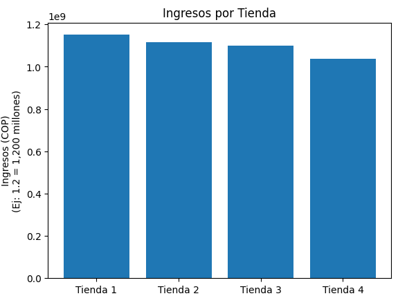
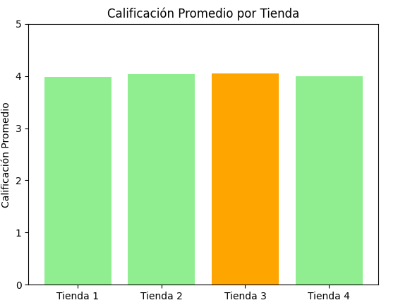
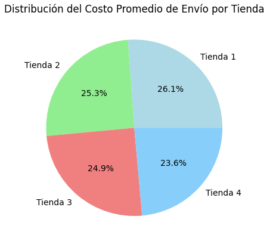
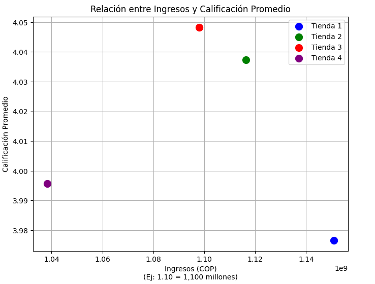

# 📊 Análisis de Desempeño de las Tiendas de Alura Store

## 📁 Descripción del Proyecto

Este proyecto consiste en un análisis detallado del rendimiento de las 4 tiendas que conforman la cadena **Alura Store**, utilizando datos de ventas extraídos de archivos CSV. Se busca determinar cuál tienda es la más adecuada para ser vendida, permitiendo al propietario iniciar un nuevo emprendimiento.

Los datos incluyen información sobre productos, categorías, precios, calificaciones de clientes, costos de envío y más. El análisis fue realizado en un entorno Google Colab y se visualiza mediante gráficos con `matplotlib`.

---

## 🎯 Objetivo

Ayudar al Sr. Juan, dueño de Alura Store, a decidir **cuál tienda vender**, basándose en métricas clave como:

- Ingresos por tienda
- Categorías más vendidas
- Calificaciones promedio de clientes
- Productos más y menos vendidos
- Costos promedio de envío
- Relación entre satisfacción del cliente e ingresos

---

## 🔍 Metodología

1. **Importación de datos** desde GitHub usando `pandas`
2. Conversión y limpieza de datos para asegurar coherencia temporal
3. Cálculo de métricas clave por tienda
4. Creación de visualizaciones comparativas
5. Interpretación de resultados
6. Recomendación final

---

## 🧪¿Cómo abrir y ejecutar el proyecto?

Para visualizar y ejecutar el análisis en Google Colab, sigue estos pasos:

Abre el notebook desde GitHub:

Puedes acceder directamente al notebook haciendo clic aquí se llama "AnalisisTiendas.ipynb" 👉 *[Abrir aqui](https://github.com/Emanuel-Acosta/AnalisisTiendas/blob/main/AnalisisTiendas.ipynb)* 

Ejecuta en Google Colab:

Una vez abierto el notebook en GitHub:

Haz clic en el botón “Open in Colab” (si está disponible), O si no, 

Copia la URL del notebook y pégala en https://colab.research.google.com/ seleccionando la pestaña GitHub para buscar el repositorio Emanuel-Acosta/AnalisisTiendas.

Conéctate a un entorno de ejecución:

Ve al menú Entorno de ejecución > Conectar.

Luego, haz clic en Entorno de ejecución > Ejecutar todo para correr todas las celdas.

Asegúrate de tener conexión a internet, ya que los datos se cargan directamente desde enlaces externos (GitHub).

## 📈 Análisis Detallado

###  Periodo de Ventas

Las 4 tiendas tienen periodos de ventas prácticamente idénticos:

- Inicio: **01-01-2020**
- Fin: **31-03-2023** (excepto Tienda 4: 30-03-2023)
- Duración: Aproximadamente **3 años y 3 meses**

---

### 1. Ingresos Totales por Tienda

| Tienda   | Ingresos (COP)       | Ingresos (USD)     |
|----------|----------------------|---------------------|
| Tienda 1 | $1,150,880,400.00    | $274,607.59         |
| Tienda 2 | $1,116,343,500.00    | $266,366.86         |
| Tienda 3 | $1,098,019,600.00    | $261,994.66         |
| Tienda 4 | $1,038,375,700.00    | $247,763.23         |

📊 **Tienda 1** lidera en ingresos.

---

### 2. Categoría más vendida por tienda

En todas las tiendas, la categoría con mayores ventas fue **Electrónicos**:

| Tienda   | Ingresos Electrónicos (COP) |
|----------|------------------------------|
| Tienda 1 | $429,493,500.00              |
| Tienda 2 | $410,831,100.00              |
| Tienda 3 | $410,775,800.00              |
| Tienda 4 | $409,476,100.00              |

---

### 3. Calificación Promedio

| Tienda   | Calificación |
|----------|--------------|
| Tienda 3 | 4.05         |
| Tienda 2 | 4.04         |
| Tienda 4 | 4.00         |
| Tienda 1 | 3.98         |

🌟 **Tienda 3** tiene la mejor calificación de satisfacción.

---

### 4. Productos Más y Menos Vendidos

Ejemplos por tienda:

- **Tienda 1:**  
  - Más vendido: Microondas (60)  
  - Menos vendido: Auriculares con micrófono (33)

- **Tienda 2:**  
  - Más vendido: Iniciando en programación (65)  
  - Menos vendido: Juego de mesa (32)

- **Tienda 3:**  
  - Más vendido: Kit de bancas (57)  
  - Menos vendido: Bloques de construcción (35)

- **Tienda 4:**  
  - Más vendido: Cama box (62)  
  - Menos vendido: Guitarra eléctrica (33)

---

### 5. Costo Promedio de Envío

| Tienda   | Costo Envío (COP) | Costo Envío (USD) |
|----------|--------------------|--------------------|
| Tienda 1 | $26,018.61         | $6.21              |
| Tienda 2 | $25,216.24         | $6.02              |
| Tienda 3 | $24,805.68         | $5.92              |
| Tienda 4 | $23,459.46         | $5.60              |

📦 **Tienda 1** tiene el mayor costo promedio de envío.

---

### 6. Gráfico de Dispersión: Ingresos vs. Calificación

No se observa una **correlación clara** entre los ingresos y la calificación promedio. Esto sugiere que el rendimiento económico **no está necesariamente ligado a la satisfacción del cliente**.

---

## ✅ Conclusión Final

🔹 **Tienda 1** genera los mayores ingresos pero tiene la **calificación más baja**.

🔹 **Tienda 3** presenta el mejor equilibrio general:  
- Alta calificación  
- Buen ingreso  
- Costo de envío razonable

🔹 **Tienda 4** es la de **menor ingreso y desempeño promedio**, aunque con el envío más barato.

🛑 **Recomendación: Vender la Tienda 4.**  
📈 Fortalecer la Tienda 3 e invertir en mejorar la experiencia del cliente en Tienda 1.

---

## 📎 Archivos Relevantes

- [Notebook Google Colab](#) *[Repositorio en github](https://github.com/Emanuel-Acosta/AnalisisTiendas/tree/main)*
- Archivos CSV utilizados desde el repositorio oficial de Alura:

*[Datos Tienda 1](https://raw.githubusercontent.com/alura-es-cursos/challenge1-data-science-latam/refs/heads/main/base-de-datos-challenge1-latam/tienda_1%20.csv)*

*[Datos Tienda 2](https://raw.githubusercontent.com/alura-es-cursos/challenge1-data-science-latam/refs/heads/main/base-de-datos-challenge1-latam/tienda_2.csv)*

*[Datos Tienda 3](https://raw.githubusercontent.com/alura-es-cursos/challenge1-data-science-latam/refs/heads/main/base-de-datos-challenge1-latam/tienda_3.csv)*

*[Datos Tienda 4](https://raw.githubusercontent.com/alura-es-cursos/challenge1-data-science-latam/refs/heads/main/base-de-datos-challenge1-latam/tienda_4.csv)*

---

## 👤 Autor

**Emanuel Acosta Gamboa**  
📧 Correo: [emanuelacosta.tr@gmail.com](mailto:emanuelacosta.tr@gmail.com)  
🔗 [LinkedIn](#) *([Emanuel-Acosta](https://www.linkedin.com/in/emanuel-acosta-gamboa/))*

---

## 🛠️ Tecnologías Utilizadas

- Python
- Pandas
- Matplotlib
- Google Colab
- GitHub

